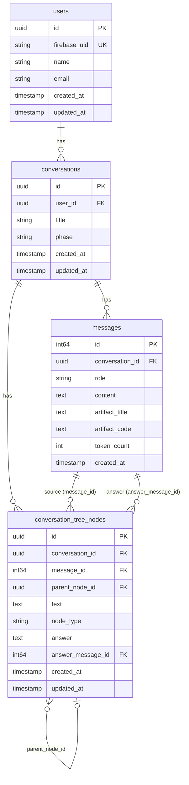

# DB Schema (Mermaid ER Diagram)

```mermaid
erDiagram
    users {
        uuid id PK
        string firebase_uid UK
        string name
        string email
        timestamp created_at
        timestamp updated_at
    }
    conversations {
        uuid id PK
        uuid user_id FK
        string title
        string phase
        timestamp created_at
        timestamp updated_at
    }
    messages {
        int64 id PK
        uuid conversation_id FK
        string role
        text content
        text artifact_title
        text artifact_code
        int token_count
        timestamp created_at
    }
    conversation_tree_nodes {
        uuid id PK
        uuid conversation_id FK
        int64 message_id FK
        uuid parent_node_id FK
        text text
        string node_type
        text answer
        int64 answer_message_id FK
        timestamp created_at
        timestamp updated_at
    }

    users ||--o{ conversations : "has"
    conversations ||--o{ messages : "has"
    conversations ||--o{ conversation_tree_nodes : "has"
    messages ||--o{ conversation_tree_nodes : "source (message_id)"
    conversation_tree_nodes }o--o| conversation_tree_nodes : "parent_node_id"
    messages ||--o{ conversation_tree_nodes : "answer (answer_message_id)"
```
