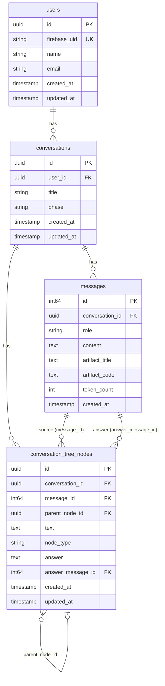

# DB スキーマ

## ER図

## テーブル説明

### `users`
Firebase Authentication と紐づくユーザーテーブル。`firebase_uid` をキーとして認証情報とアプリユーザーを連携する。

### `conversations`
1つの学習セッション（会話）を表す。`phase` フィールドで会話の進行状態を管理し、AIが終了を示唆するタイミングを制御する。

### `messages`
会話内のやり取りを1行1メッセージで保存。`role` は `user` または `assistant`。Generative UIが生成された場合は `artifact_title` と `artifact_code` にReactコンポーネントのコードが格納される。

### `conversation_tree_nodes`
AIが生成した「問い」を木構造で管理するテーブル。各ノードはメッセージと紐づき、`parent_node_id` で親子関係を表現する。`node_type` で「質問」「回答」などの種別を区別する。

## マイグレーション

マイグレーションファイルは `backend/` 以下で管理されています。詳細は [ローカル開発ガイド](local-dev.md) を参照してください。
